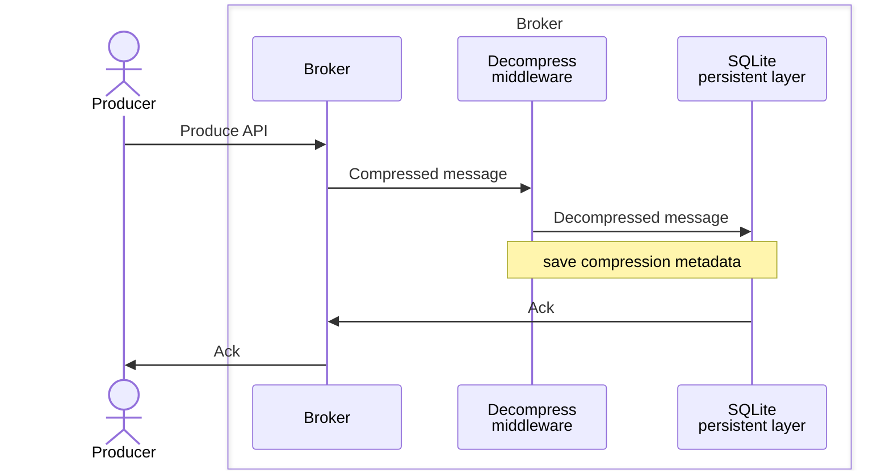
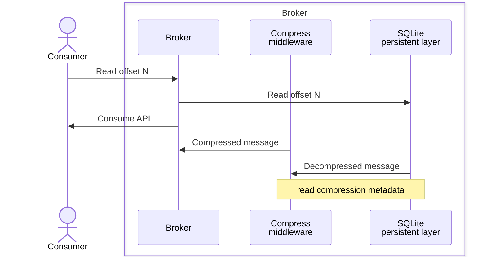

Producer

```mermaid
sequenceDiagram
    actor P as Producer
    box Broker
    participant B as Broker
    participant DM as Decompress<br/>middleware
    participant SQL as SQLite<br/>persistent layer
    end
    P->>B: Produce API
    B->>DM: Compressed message
    DM->>SQL: Decompressed message
    Note over DM,SQL: save compression metadata
    SQL->>B: Ack
    B->>P: Ack
```
Consumer

```mermaid
sequenceDiagram
    actor C as Consumer
    box Broker
    participant B as Broker
    participant DM as Compress<br/>middleware
    participant SQL as SQLite<br/>persistent layer
    end
    C->>B: Read offset N
    B->>SQL: Read offset N
    B->>C: Consume API
    DM->>B: Compressed message
    SQL->>DM: Decompressed message
    Note over DM,SQL: read compression metadata
```